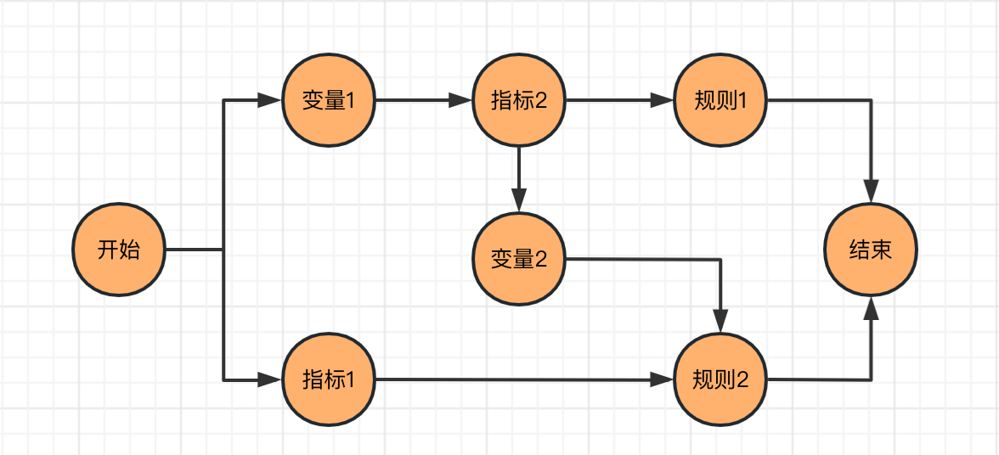

# 开发文档

- 后端技术栈：Java、SpringBoot、Mysql、Redis、MongoDB
- 前端技术栈：React、Ant Design Pro
## 本地运行

参考 [快速开始/本地运行](./getting-started#本地运行)

## 项目结构
```
.
├── backend 
└── frontend
```
项目分为前端和后端，其中后端又分为：

```
.
├── access   接入模块
├── common   通用模块
├── dal      数据库模块
├── engine   核心引擎模块
├── utils    工具类
├── variable 变量模块
└── web      后端配置模块
```
前端基于 Ant Design Pro 开发的，具体请参考：https://pro.ant.design/zh-CN/docs/getting-started
## 设计思想

一次风控请求事件会经过多个规则组，每个规则组又包含多个规则，不同的规则之间可能共用相同的指标或变量。为了提高系统的性能，我们将规则组，规则，指标，变量抽象为可执行的节点 `GraphNode`，同时抽象出一个起始（BEGIN）和一个结束（END）节点。不同的节点之间有依赖关系，例如`用户1分钟登录次数大于5`这条规则（ruleLogin），需要指标`用户1分钟登录次数`（login1Min）。系统在构建时会自动分析依赖关系：END -> ruleLogin -> login1Min -> BEGIN。随着业务的复杂，规则和指标变量的增多，系统构建的是包含有一个开始节点和一个结束节点的 `DAG` 有向无环图。



系统的运行则是反向的，即从 BEGIN 节点开始直到 END 结束。当前节点执行结束后，被依赖的所有节点将会并发的执行，所以一次风控请求耗时取决于 END 到 BEGIN 之间一条链上节点执行时间之和的最大值，而非所有节点之和。实际应用中，链的长度不会很长，但节点会很多，这种设计会极大提升系统性能。另外当事件命中一个规则后，直接返回结果，而非等到所有节点执行完才返回。

## 系统核心类

**`GraghNode`**

抽象规则组，规则，指标，变量为可执行的节点，包含配置数据，依赖关系，执行逻辑等。

**`DependencyContext`**

构建依赖的上下文，主要提供节点的获取和节点运行时的依赖。

**`RiskContext`**

风控请求上下文，主要包含请求数据，节点运行时的数据和状态。

**`VariableService`**

获取变量数据的接口

**`AccumulateService`**

获取指标数据的接口

**`DependencyParser`**

依赖解析的核心实现类

## 拓展点

**1. RiskBeforeHandler 接口**

风控检测前置处理器，主要用于风控检测前的数据准备。默认有Event参数映射，ip地址信息转换和全局的名单检测。

**2. RiskAfterHandler 接口**

风控检测后置处理器，主要用于风控检测后的收尾工作。默认有记录风控日志到 MongoDB，执行结束后的回调处理。在此还可以拓展风控数据的mq消息输出、命中规则的惩罚能力等。

**3. RiskContext.addFinishCallback 方法**

风控处理前和进行中，可以添加结束时的回调函数。后置指标的计算基于此实现。


>在 `RiskAfterHandler` 中不建议调用 `RiskContext.addFinishCallback`，可能会造成非预期结果。


**4. VariableFunction 接口**

通过实现此接口可以将外部的数据或服务集成到系统中。

**5. AccumulateService 接口**

获取指标数据的接口

**6. AggFunction 接口**

指标的计算，可通过实现此接口拓展数据的聚合能力，系统默认支持
- AGV: 平均
- COUNT: 计数
- COUNT_DISTINCT: 去重计数
- DISTINCT: 去重
- LATEST: 最近
- MAX: 最大
- MIN: 最小
- SUM: 求和
