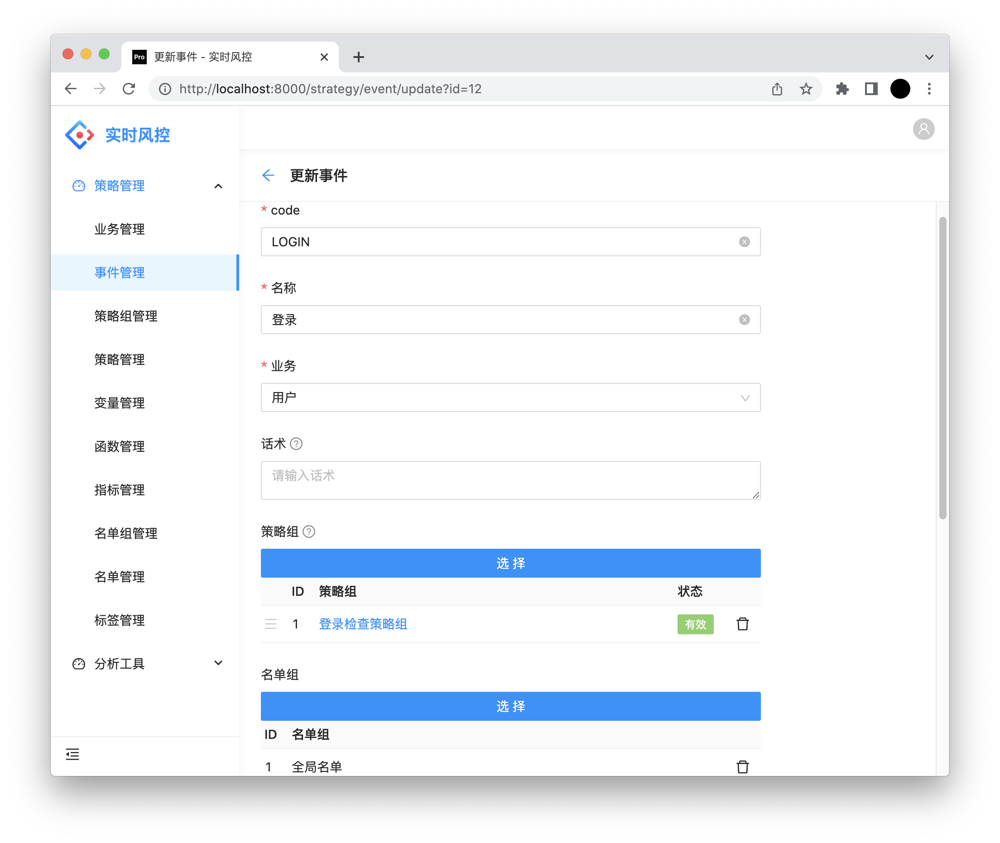

# 参考文档

## Groovy

Groovy 表达式，用于规则的逻辑判断，规则组的前置条件判断，变量参数解析，指标的前置条件判断、分组和聚合数据解析等。采用 Groovy，是因为其灵活的特点能够满足复杂而多变的需求。

在 Groovy 表达式中，我们可以使用的数据源有三种：
1. 业务传参
2. `指标` 聚合的指标数据
3. `变量` 通过函数调用获取的外部的数据
## 变量
通过函数调用获取的数据，我们称之为：`变量`。

变量的配置分为三步：

**1. 实现`VariableFunction`接口**

**function**：返回函数名称，用于页面配置。

**getVariable**：函数的实际执行逻辑。该函数的参数由引擎动态解析成 `Map<String, Object>` 对象。

**2. 函数配置**

**函数名称**：实现了 `VariableFunction` 接口 `function` 返回的值。

**函数参数**：Groovy Map 结构，配置变量时作为参数依赖的参考。

**返回结果**：json，计划作为规则编写时的提示使用。

**3. 变量配置**

**名称**：符合 Groovy 命名规则，与指标名一起全局唯一，用于 Groovy 表达式。

**函数**：函数名称。

**参数**：Groovy 表达式，返回 `Map<String, Object>` 对象，作为参数传递给 `VariableFunction.getVariable` 。

## 指标

**名称**：符合 Groovy 命名规则，与变量名一起全局唯一，用于 Groovy 表达式。

**绑定事件**：绑定的事件才会计算聚合数据。

**分组key**：Groovy 表达式，返回 `List` 对象，聚合数据的主体，例如 `UserId` 。

**聚合函数**：计数、平均值、求和、最大值、最小值等。

**聚合key**：Groovy 表达式，返回特定数据由于计算平均值、最大值、最小值等。

**窗口类型**：分为 `固定窗口` 和 `滑动窗口`。例如：`1个自然日` 使用固定窗口，`最近3小时` 使用滑动窗口。

**时间窗口**：数字，配合单位表示 `1小时` 或 `1天`。

**时间粒度**：在滑动窗口中，最小的存储数据单元。例如：最近8小时，时间粒度为1小时，则每小时会存储一个数据，总共存8个，最后再综合计算。

**单位**：分、时、日、月、周、年。

>在 Redis 实现下，滑动窗口的时间粒度同时间窗口建议1:10，即相差一个数量级。差距过多会导致 Redis 存储增多。

**前置条件**：Groovy 表达式，用于判断当前事件是否需要聚合数据。

>前置条件除了可以使用数据源的数据外，还可以通过 `Result` 引用本次风控请求的结果。

## 规则

**名称**：规则名称。

**状态**：`有效`、`无效`、`测试`。当置为测试时，规则会执行，但不会命中。

**规则表达式**：返回风控级别 `PASS`，`REVIEW`，`REJECT`，或者 `TRUE/FALSE` 分别表示`PASS`和`REJECT`

**话术**：当规则命中时返回给用户的话术（配置优先级：规则 > 规则组 > 事件）。

**返回json**：规则命中时返回给调用方的数据。

## 规则组

**名称**：规则组名称。

**状态**：`有效`、`无效`、`测试`。当置为无效或测试时，包含的规则也将是无效或测试。

**前置条件**：Groovy 表达式，返回 `TRUE`，`FALSE`。当前置条件不满足时，包含的规则不会被命中。

**话术**：当规则命中时返回给用户的话术（配置优先级：规则 > 规则组 > 事件）。

**规则**：包含一系列规则，可调整顺序，优先返回命中的规则。

## 事件

**code**：事件code，业务接入时传入。

**名称**：事件名称。

**业务**：业务。

**话术**：当规则命中时返回给用户的话术（配置优先级：规则 > 规则组 > 事件）。

**规则组**：包含一系列的规则组，可调整顺序，优先返回命中的规则组。

**名单组**：事件的前置名单检查，如果命中，直接返回结果。可调整顺序。

>风控请求的前置检查会处理事件绑定的名单，名单检查顺序：白名单，黑名单，维度顺序：USER_ID，MOBILE，DEVICE_ID，CLIENT_IP。实现类见 `GrayListBeforeHandler`。
## 业务

**code**：业务code。

**名称**：业务名称。

## 名单组

**名称**：名单组名称。

**分类**：分类。
## 名单

**名单组**：名单组。

**类型**：`黑名单`、`白名单`。

**维度**：`USER_ID` 用户id，`MOBILE` 手机号，`DEVICE_ID` 设备id，`CLIENT_IP` ip地址。

**数据**：根据维度，填对应的数据。

**生效时间**：名单生效时间。

**过期时间**：名单过期时间。

>为了性能，名单的查询通过 Redis，数据库的名单会定期同步到 Redis 中，定时任务时间间隔见 `GrayListOpServiceImpl.schedule`。
## 模拟运行

**添加Tag TEST**：请求标识，勾选后执行规则但不计算指标。

## 风控历史

点击展示详细的请求数据，上下文数据以及风控结果。